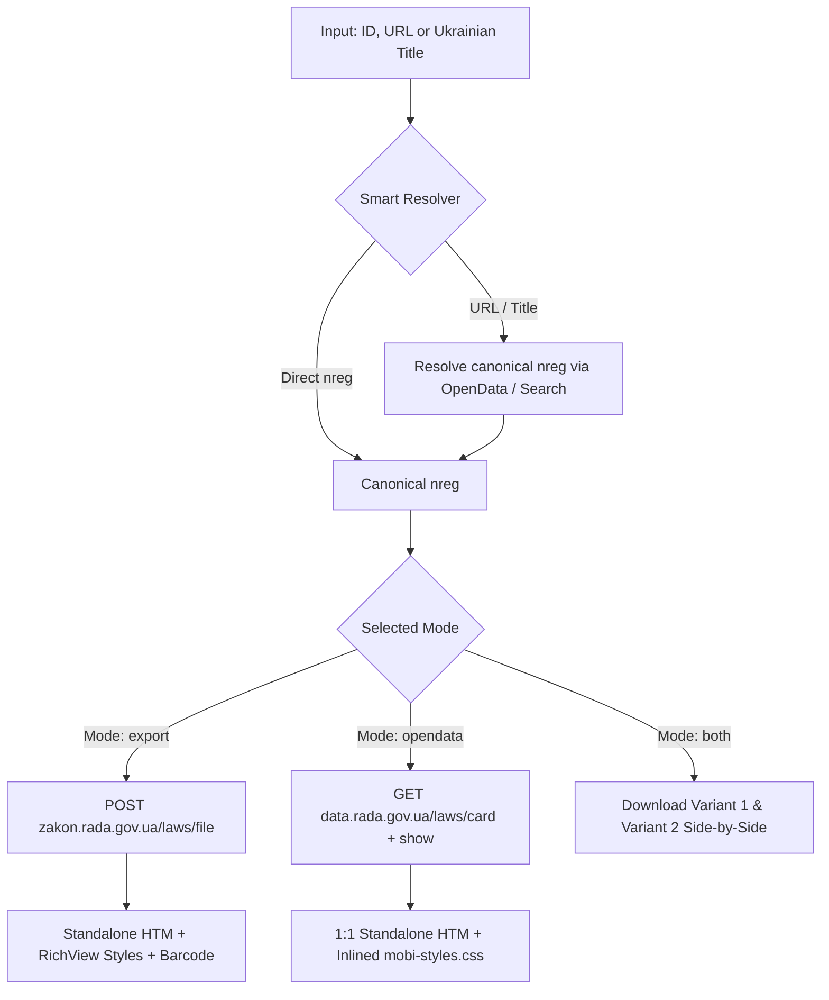

# 📜 Rada HTM Downloader (Завантажувач законодавства України)

[](https://www.python.org/)
[](LICENSE)
[]()
[](https://data.rada.gov.ua/)

> 🇬🇧 **High-performance, zero-loss bulk downloader and API client for Ukrainian legislation documents (`zakon.rada.gov.ua` & `data.rada.gov.ua`) with automatic title-to-ID resolution, 1:1 official filename preservation, and local instant caching for AI agents (LLM / MCP / RAG) and legal pipelines.**
>
> 🇺🇦 **Високопродуктивний автономний інструмент для автоматизованого завантаження нормативно-правових актів та законів України (`zakon.rada.gov.ua` та `data.rada.gov.ua`) у форматі 1:1 HTM, оптимізований для систем штучного інтелекту, AI-агентів (LLM, MCP, RAG) та швидкісної пакетної обробки 100+ реєстрів із 100% точним збереженням структури.**

---

## 🇺🇦 Українська версія

Високопродуктивний автономний інструмент для швидкісного завантаження нормативно-правових актів та кодексів України у форматі `.htm` з порталів **[zakon.rada.gov.ua](https://zakon.rada.gov.ua)** та **[data.rada.gov.ua](https://data.rada.gov.ua)** (Портал відкритих даних Верховної Ради України).

Розроблено з урахуванням офіційних рекомендацій **Управління комп'ютеризованих систем Апарату ВРУ** та оптимізовано для роботи з великими реєстрами (100+ актів), AI-агентами (LLM / MCP) та локальними базами знань.

### ✨ Основні можливості

- ⚡ **Direct Single-Request Architecture:** Завантаження файлу за 1 прямий HTTP POST запит замість подвійного обходу сторінок (економія до 70% мережевого трафіку).
- 🧠 **Автоматичний Резолвер назв:** Розуміє як системні номери (`322-08`, `435-15`, `254к/96-вр`), так і повні URL-адреси та текстові назви (`ЦИВІЛЬНИЙ КОДЕКС УКРАЇНИ`, `Конституція України`, `Кримінальний кодекс України`).
- 🔄 **Два взаємодоповнюючі режими:**
  - **Варіант 1 (Експорт `zakon.rada.gov.ua`):** Автономний офлайн-документ з оригінальними RichView CSS-стилями (`rvts...`) та графічним штрихкодом.
  - **Варіант 2 (OpenData API `data.rada.gov.ua`):** Офіційний REST API з автоматичним збиранням 1:1 ідентичного файлу з автономними CSS-стилями `mobi-styles.css`.
- 📁 **1:1 Точність найменування файлів:** Автоматичне декодування офіційних назв з HTTP-заголовка `Content-Disposition` (з підтримкою RFC 5987/6266, UTF-8, CP1251 та захистом від заборонених символів ОС):
  > `Цивільний кодекс України - Кодекс України № 435-IV від 16.01.2003 - d119580-20260805.htm`
- 🚀 **Миттєве дворівневе кешування (`0.00с`):** Завдяки локальному JSON-кешу та резервному скануванню директорії, повторний запуск пакету на 100+ документів завершується миттєво без жодного звернення до мережі.
- 🛡️ **Пейсинг та захист від блокувань (Rate Limiting):** Автоматичний інтервал між запитами (`--delay 0.25с`), ізольовані HTTP-сесії та повторні спроби з експоненційним бекоффом при збоях мережі.
- 🖥️ **Зручне інтерактивне меню для Windows:** Готовий скрипт `get_htm.cmd` із пошуком встановленого Python та підтримкою Drag-and-Drop текстових списків.

---

### 💻 Використання (UA)

#### 1. Інтерактивне Windows-меню (`get_htm.cmd`)

Запустіть `get_htm.cmd` у Провіднику або терміналі:

```text
================================================================
       ЗАВАНТАЖУВАЧ HTM ДОКУМЕНТІВ З ZAKON.RADA.GOV.UA
         (Оптимізовано для швидкісного пакетного режиму)
================================================================

 [1] Варіант 1: Прямий виклик експортного API (zakon.rada.gov.ua)
 [2] Варіант 2: Збирання 1:1 файлу через OpenData API (data.rada.gov.ua)
 [3] Завантажити Обидва варіанти (Варіант 1 + Варіант 2)
 [4] Пакетне завантаження зі списку файлу (.txt зі списком законів)
 [5] Швидкий тест основних кодексів (Конституція, КЗпП, ЦКУ, ККУ)
 [6] Відкрити робочу папку з файлами

 [0] Вихід
================================================================
```

#### 2. Командний рядок Python

```bash
# За номером або назвою
python get_htm.py 322-08
python get_htm.py "ЦИВІЛЬНИЙ КОДЕКС УКРАЇНИ"
python get_htm.py "https://zakon.rada.gov.ua/laws/show/254к/96-вр#Text"

# Пакетне завантаження зі списку файлу з кешуванням
python get_htm.py --file test_laws.txt --skip-existing --delay 0.25

# Порівняння обох варіантів
python download_both_variants.py "ЦИВІЛЬНИЙ КОДЕКС УКРАЇНИ"
```

---

## 🇬🇧 English Version

High-performance, standalone tool designed for high-throughput downloading and processing of Ukrainian legislation acts and codes in `.htm` format directly from **[zakon.rada.gov.ua](https://zakon.rada.gov.ua)** and the **[data.rada.gov.ua](https://data.rada.gov.ua)** Open Data Portal.

Built following official guidelines from the **Computerized Systems Directorate of the Verkhovna Rada of Ukraine Secretariat**, optimized for bulk ingestion (100+ documents), AI workflows (LLM, MCP, RAG pipelines), and local legal knowledge bases.

### 🌟 Key Features

- ⚡ **Direct Single-Request Download:** Downloads export files via a single HTTP POST request instead of multi-step page crawls (reducing data transfer by ~70%).
- 🧠 **Smart Title & Alias Resolver:** Seamlessly resolves document numbers (`322-08`, `435-15`, `254к/96-вр`), URLs, and full textual titles (e.g. `ЦИВІЛЬНИЙ КОДЕКС УКРАЇНИ`, `Конституція України`, `Кримінальний кодекс України`) into canonical Rada document IDs.
- 🔄 **Dual Complementary Modes:**
  - **Variant 1 (Web Export `zakon.rada.gov.ua`):** Standalone offline `.htm` document with embedded RichView styles (`rvts...`) and barcode verification stamps.
  - **Variant 2 (OpenData API `data.rada.gov.ua`):** Clean HTML from official REST API assembled 1:1 with standalone `mobi-styles.css`.
- 📁 **1:1 Official Filename Fidelity:** Decodes official Ukrainian filenames from HTTP `Content-Disposition` headers (supporting RFC 5987/6266, UTF-8, CP1251, with OS-safe path sanitization):
  > `Цивільний кодекс України - Кодекс України № 435-IV від 16.01.2003 - d119580-20260805.htm`
- 🚀 **Zero-Cost Instant Caching (`0.00s`):** Two-tier local cache (JSON index + directory scanner) ensures repeat runs across 100+ documents finish instantly with zero network requests.
- 🛡️ **Rate Limiting & Anti-Ban Protections:** Configurable pacing delay (`--delay 0.25s`), isolated HTTP sessions to avoid cookie collisions, and exponential backoff retry on transient network errors.
- 🖥️ **Interactive Windows Menu:** Ready-to-use `get_htm.cmd` batch interface with auto-detection of installed Python and file Drag-and-Drop.

---

### 💻 CLI Usage (EN)

#### Download by Document Number, Title, or URL
```bash
# By canonical document ID (nreg)
python get_htm.py 322-08

# By full Ukrainian title
python get_htm.py "ЦИВІЛЬНИЙ КОДЕКС УКРАЇНИ"

# By URL
python get_htm.py "https://zakon.rada.gov.ua/laws/show/254к/96-вр#Text"
```

#### Bulk Download from File List
```bash
python get_htm.py --file test_laws.txt --skip-existing --delay 0.25
```

#### Choose Download Mode
```bash
# Variant 1: Direct Web Export (Default)
python get_htm.py 322-08 --mode export

# Variant 2: Official OpenData API
python get_htm.py 322-08 --mode opendata

# Both Variants Side-by-Side
python get_htm.py 322-08 --mode both
```

#### Side-by-Side Comparison Script
```bash
python download_both_variants.py "4742-20"
python download_both_variants.py "ЦИВІЛЬНИЙ КОДЕКС УКРАЇНИ"
```

---

## ⚙️ CLI Options Reference

| Option | Description | Default |
|---|---|---|
| `targets` | One or more document IDs, URLs, or Ukrainian law titles | — |
| `-f, --file` | Path to `.txt` file containing list of targets (one per line) | — |
| `-m, --mode` | Download mode: `export` (Web Export), `opendata` (API), `both` | `export` |
| `-o, --output` | Custom destination filename (single-document downloads only) | Auto (from Rada) |
| `-d, --dir` | Directory to save downloaded files | `.` (current) |
| `-p, --delay` | Pause between requests in seconds (rate limiting) | `0.25` |
| `-s, --skip-existing` | Skip downloading if target file already exists locally | `False` |

---

## 📊 Architecture & Flow



---

## 📁 Repository Structure

```text
makedown-get-htm/
├── get_htm.py                # Core downloader CLI & Python module
├── get_htm.cmd               # Interactive Windows batch menu (UTF-8, CRLF)
├── download_both_variants.py # Side-by-side comparison helper script
├── test_laws.txt             # Sample batch list for testing
├── api.md                    # Official Rada OpenData API documentation
├── recommend api using...txt # Official support guidance from Rada Computerized Systems Directorate
├── .download_cache.json      # Local index for instant zero-network caching (0.00s)
└── README.md                 # Project documentation
```

---

## 📜 License

This project is licensed under the [MIT License](LICENSE). You are free to use, modify, and integrate this software into open-source or commercial applications.

---

## 🤝 Acknowledgments

- **Verkhovna Rada of Ukraine** and the **Open Data Portal** ([data.rada.gov.ua](https://data.rada.gov.ua)) for providing open access to Ukrainian legislative data.
- The Computerized Systems Directorate of the Verkhovna Rada Secretariat for their guidance on API integration best practices.
